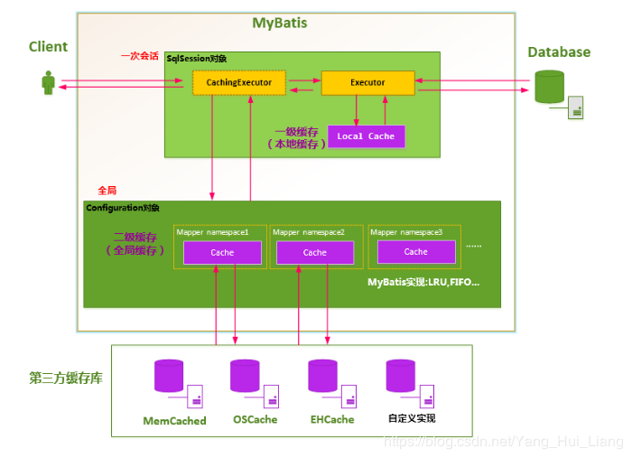

# Mybatis缓存
   MyBatis的缓存机制整体设计以及二级缓存的工作模式

## 一级缓存的生命周期有多长？
　  a、MyBatis在开启一个数据库会话时，会 创建一个新的SqlSession对象，SqlSession对象中会有一个新的Executor对象。Executor对象中持有一个新的PerpetualCache对象；当会话结束时，SqlSession对象及其内部的Executor对象还有PerpetualCache对象也一并释放掉。
　　b、如果SqlSession调用了close()方法，会释放掉一级缓存PerpetualCache对象，一级缓存将不可用。
　　c、如果SqlSession调用了clearCache()，会清空PerpetualCache对象中的数据，但是该对象仍可使用。
　　d、SqlSession中执行了任何一个update操作(update()、delete()、insert()) ，都会清空PerpetualCache对象的数据，但是该对象可以继续使用

## 怎么判断某两次查询是完全相同的查询？
   mybatis认为，对于两次查询，如果以下条件都完全一样，那么就认为它们是完全相同的两次查询。
　　2.1 传入的statementId
　　2.2 查询时要求的结果集中的结果范围
　　2.3. 这次查询所产生的最终要传递给JDBC java.sql.Preparedstatement的Sql语句字符串（boundSql.getSql() ）
　　2.4 传递给java.sql.Statement要设置的参数值

## 二级缓存
   MyBatis的二级缓存是Application级别的缓存，它可以提高对数据库查询的效率，以提高应用的性能。
   SqlSessionFactory层面上的二级缓存默认是不开启的，二级缓存的开席需要进行配置，实现二级缓存的时候，MyBatis要求返回的POJO必须是可序列化的。