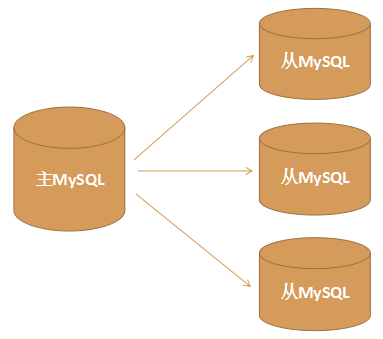

## 一主多从架构图

## 主从复制架构原理（一主多从、双主双重）
   * 1. 当master上数据发生改变时，则将其改变写入二进制文件中。
   * 2. slave服务器会在一定时间间隔内对master主服务器上的二级制日志进行探测，探测其是否发生过改变。
   * 3. 如果探测到master主服务器的二进制日志发生了改变，则开启一个I/O Thread请求master二级制事件。
   * 4. 同时master主服务器为每个I/O Thread启动一个dump Thread，用于向其发送二进制日志。
   * 5. slave从服务器将接收到的二进制日志保存至自己本地的中继日志文件中。
   * 6. slave从服务器将启动SQL Thread中继日志中读取二进制日志，在本地重放，使得其数据和主服务器一致；
   * 7. 最后I/O Thread和SQL Thread将进入睡眠状态，等待下一次被唤醒。

## 多实例配置
* 1、在MySQL安装主目录下创建/data/3307, /data/3308/, /data/3309, /data/3310四个目录；
* 2、执行数据库初始化，在MySQL的/usr/local/mysql-5.7.18/bin目录下执行命令： 
    >* ./mysqld --initialize-insecure --basedir=/usr/local/mysql-5.7.18 --datadir=/usr/local/mysql-5.7.18/data/3307 --user=mysql
    >* ./mysqld --initialize-insecure --basedir=/usr/local/mysql-5.7.18 --datadir=/usr/local/mysql-5.7.18/data/3308 --user=mysql
    >* ./mysqld --initialize-insecure --basedir=/usr/local/mysql-5.7.18 --datadir=/usr/local/mysql-5.7.18/data/3309 --user=mysql
    >* ./mysqld --initialize-insecure --basedir=/usr/local/mysql-5.7.18 --datadir=/usr/local/mysql-5.7.18/data/3310 --user=mysql
    >* 其中 initialize-insecure 表示不生成MySQL数据库root用户的随机密码，即root密码为空；
* 3、在/data/3307, /data/3308/, /data/3309, /data/3310 四个目录下分别创建一个my.conf文件；
* 4、配置四个MySQL数据库服务的my.conf文件  
      [client]  
      port = 3307  
      socket = /usr/local/mysql-5.7.18/data/3307/mysql.sock  
      default-character-set=utf8  
      [mysqld]  
      port = 3307  
      socket = /usr/local/mysql-5.7.18/data/3307/mysql.sock  
      datadir = /usr/local/mysql-5.7.18/data/3307  
      log-error = /usr/local/mysql-5.7.18/data/3307/error.log  
      pid-file = /usr/local/mysql-5.7.18/data/3307/mysql.pid  
      character-set-server=utf8  
      lower_case_table_names=1  
      autocommit = 1
      
## 多实例启动
* 1、切换到/usr/local/mysql-5.7.18/bin目录下，使用 msyqld_safe 命令指定配置文件并启动MySQL服务：
* 2、./mysqld_safe --defaults-file=/usr/local/mysql-5.7.18/data/3307/my.conf &
* 3、./mysqld_safe --defaults-file=/usr/local/mysql-5.7.18/data/3308/my.conf &
* 4、./mysqld_safe --defaults-file=/usr/local/mysql-5.7.18/data/3309/my.conf &
* 5、./mysqld_safe --defaults-file=/usr/local/mysql-5.7.18/data/3310/my.conf &
* 其中 --defaults-file 是指定配置文件，& 符合表示后台启动；

## 多实例配置
* 1、使用用端口、主机登录 ./mysql -uroot -p -P3307 -h127.0.0.1 登录进入MySQL
* 2、修改mysql的密码，执行： alter user 'root'@'localhost' identified by '123456';（其中123456是我们设置的密码）
* 3、授权远程访问，执行命令：（这样远程客户端才能访问）
  grant all privileges on *.* to root@'%' identified by '123456';
  其中*.* 的第一个 * 表示所有数据库名，第二个 * 表示所有的数据库表；
  root@'%' 中的root表示用户名，%表示ip地址，%也可以指定具体的ip地址，比如root@localhost，root@192.168.10.129
* 4、执行以下如下命令刷新权限：  
      flush privileges; 
## 多实例关闭
方式一: ./mysqladmin -uroot -p -S /usr/local/mysql-5.7.18/data/3307/mysql.sock shutdown  
方式二：./mysqladmin -uroot -p -P3307 -h127.0.0.1 shutdown  
方式三: 如果已经进入到了MySQL的命令行，可以直接执行 shutdown;   
退出MySQL命令行，执行： exit

## 一主多从环境搭建
### 环境配置
* 配置主从MySQL配置文件my.conf  
    主(3307)里面加入
    log-bin=mysql-bin   #表示启用二进制日志
    server-id=3307        #表示server编号，编号要唯一
  
    从(3308)里面加入
    server-id=3308        #表示server编号，编号要唯一
    
    从(3309)里面加入
    server-id=3309        #表示server编号，编号要唯一
    
    从(3310)里面加入
    server-id=3310        #表示server编号，编号要唯一
### 服务启动
   ./mysqld_safe --defaults-file=/usr/local/mysql-5.7.18/data/3307/my.conf&  
   ./mysqld_safe --defaults-file=/usr/local/mysql-5.7.18/data/3308/my.conf&  
   ./mysqld_safe --defaults-file=/usr/local/mysql-5.7.18/data/3309/my.conf &  
   ./mysqld_safe --defaults-file=/usr/local/mysql-5.7.18/data/3310/my.conf &

### 设置主从关系
   * 1、在主服务器上创建复制数据的账号并授权：
     grant replication slave on *.* to 'copy'@'%' identified by '123456';
   * 2、建议重置一下主服务状态，执行命令：reset master;
   * 3、在主服务器上执行命令，获取主服务器二进制binlog文件名及坐标（二进制文件名和坐标值在后面会用到）：  
     show master status;  
     在从服务器上执行命令，设置从服务器的master
   * 4、重置一下：  
     stop slave;  
     reset slave; 
   * 5、
     change master to master_host='192.168.106.128',master_user='copy',  
     master_port=3307,master_password='123456',  
     master_log_file='mysql-bin.000001',master_log_pos=154;
   * 6、在从机器上执行开始复制命令：  
     start slave;
### 主从验证
   * 在主服务器上创建数据库、表、数据，然后在从服务器上查看是否已经复制
   * 以上操作过程显示正常，则主从服务器配置完成；
   * 查看主从复制binlog日志文件内容：show binlog events in 'mysql-bin.000001';

## 双主双从模式

### 环境配置
   * 1、配置每一台MySQL服务器的配置文件my.conf（同一主多从）
   * 2、与一主多从一样，所有主节点配置文件加上binlog配置 
       主(3307)里面加入
       log-bin=mysql-bin   #表示启用二进制日志
       server-id=3307        #表示server编号，编号要唯一
     
       主(3308)里面加入
       log-bin=mysql-bin   #表示启用二进制日志
       server-id=3308        #表示server编号，编号要唯一
       
       从(3309)里面加入
       server-id=3309        #表示server编号，编号要唯一
       
       从(3310)里面加入
       server-id=3310        #表示server编号，编号要唯一
   * 3、第一台主服务器3307的my.conf文件增加如下配置：(Master 3307)  
        auto_increment_increment=2  
        auto_increment_offset=1  
        log-slave-updates  
        sync_binlog=1  
        sync_binlog=0，当事务提交之后，MySQL不做fsync之类的磁盘同步指令刷新binlog_cache中的信息到磁盘，而让Filesystem自行决定什么时候来做同步，或者cache满了之后才同步到磁盘。
        sync_binlog=n，当每进行n次事务提交之后，MySQL将进行一次fsync之类的磁盘同步指令来将binlog_cache中的数据强制写入磁盘。  
        1、从库只开启log-bin功能，不添加log-slave-updates参数，从库从主库复制的数据不会写入log-bin日志文件里。  
        2、直接向从库写入数据时，是会写入log-bin日志的。  
        3、开启log-slave-updates参数后，从库从主库复制的数据会写入log-bin日志文件里。这也是该参数的功能。
   * 4、第二台主服务器3308的my.cnf文件增加如下配置：(Master 3308)
        auto_increment_increment=2  
        auto_increment_offset=2  
        log-slave-updates  
        sync_binlog=1  
### 配置项的说明
   * auto_increment_increment，控制主键自增的自增步长，用于防止Master与Master之间复制出现重复自增字段值，通常auto_increment_increment=n，有多少台主服务器，n 就设置为多少；
   * auto_increment_offset＝1设置自增起始值，这里设置为1，这样Master的auto_increment字段产生的数值是：1, 3, 5, 7, …等奇数ID
   * 注意auto_increment_offset的设置，不同的master设置不应该一样，否则就容易引起主键冲突，比如master1的offset=1，则master2的offset=2，master3的offset=3
   * 在双主模式中，log-slave-updates 配置项一定要配置，否则在master1（3307）上进行了更新数据，在master2（3308）和slave1（3309）上会更新，但是在slave2（3310）上不会更新 
   * sync_binlog表示每几次事务提交，MySQL把binlog缓存刷进日志文件中，默认是0，最安全的是设置为1；

### 服务启动（同一主多从）

### 主从设置
   * 1、在两台主服务器上创建复制账号并授权：（3307、3308）
        使用端口、主机登录进入两台主MySQL：  
         ./mysql -uroot -p -P3307 -h127.0.0.1  
          ./mysql -uroot -p -P3308 -h127.0.0.1  
          在主服务器上创建复制数据的账号并授权：  
          grant replication slave on *.* to 'copy'@'%' identified by '123456';
   * 2、在两台主服务器上停止复制并刷新binlog日志：（3307、3308）  
        在MySQL命令行执行：  
        stop slave;  
        reset slave;  
        reset master;
   * 3、在从服务器上停止复制：（3309、3310）  
        在MySQL命令行执行：  
        stop slave;  
        reset slave;  
        reset master;
   * 4、在主服务器上查看二进制日志文件和Position值：（3307、3308）  
        在MySQL命令行执行：  
        即在3307和3308上分别执行：show master status;  
   * 5、在Slave上设置Master（相当于是4台都需要设置）  
     * 设置从服务器3308、3309，他们的主均为3307，即在3308和3309上执行如下操作：  
        change master to master_host='192.168.106.128',  
         master_user='copy',  
         master_password='123456',  
         master_port=3307,   
         master_log_file='mysql-bin.000001',  
         master_log_pos=154;  
      * 设置从服务器3307、3310，他们的主均为3308，即在3307和3310上执行如下操作：  
         change master to master_host='192.168.106.128',  
         master_user='copy',  
         master_password='123456',  
         master_port=3308,   
         master_log_file='mysql-bin.000001',  
         master_log_pos=154;	
   * 6、在四台MySQL服务器上执行：start slave; （MySQL命令行执行），执行后即开始进入主从复制状态  
         检查从服务器复制功能状态，执行命令：  
         mysql> show slave status \G  
         如果Slave_IO_Running和Slave_SQL_Running的值为Yes，即表示复制功能配置正常；
         
### 双主双从验证
   设置好双主双从复制后：  
   1. 一个主出现问题，可以切换到另外的主进行写数据，新主同步数据给它的从；  
   2. 待问题旧主恢复服务后，新的主会同步数据给它，它再同步数据给自己的从，这样不会出现数据的不同步和服务的不可用。     