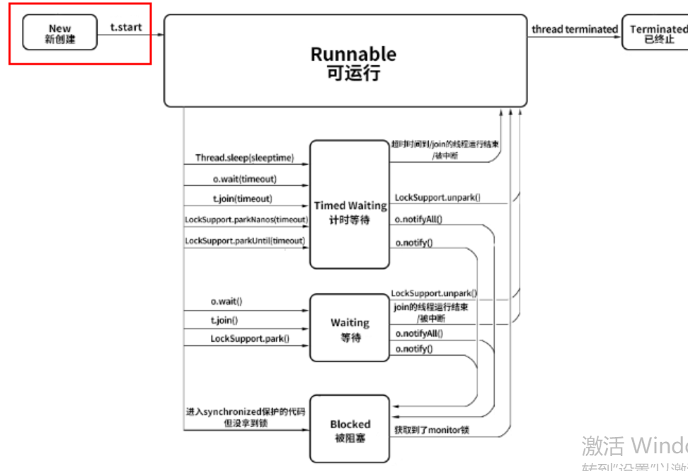

## 线程的生命周期
    
   * 线程生命周期的6中状态: New（新创建）、Runnable（可运行）、 Blocked（阻塞状态）、Waiting（等待）、Timed Waiting（计时等待）、Terminated（被终止）
        1. NEW 新创建
            * New 表示线程被创建但尚未启动的状态：当我们用 new Thread() 新建一个线程时，如果线程没有开始运行 start() 方法，所以也没有开始执行 run() 方法里面的代码，那么此时它的状态就是 New。而一旦线程调用了 start()，它的状态就会从 New 变成 Runnable
        2. Runnable 可运行
            * 处于 Runnable 状态的线程有可能正在执行，也有可能没有正在执行，正在等待被分配 CPU 资源。如果一个正在运行的线程是 Runnable 状态，当它运行到任务的一半时，执行该线程的 CPU 被调度去做其他事情，导致该线程暂时不运行，它的状态依然不变，还是 Runnable，因为它有可能随时被调度回来继续执行任务。
        3. Blocked 被阻塞
            * 从 Runnable 状态进入 Blocked 状态只有一种可能，就是进入 synchronized 保护的代码时没有抢到 monitor 锁，无论是进入 synchronized 代码块，还是 synchronized 方法，都是一样。从 Runnable 状态进入 Blocked 状态只有一种可能，就是进入 synchronized 保护的代码时没有抢到 monitor 锁，无论是进入 synchronized 代码块，还是 synchronized 方法，都是一样。
        4. 线程进入 Waiting 状态有三种可能性。
            a. 没有设置 Timeout 参数的 Object.wait() 方法。
            b. 没有设置 Timeout 参数的 Thread.join() 方法。
            c. ReentrantLock，如果线程在获取这种锁时没有抢到该锁就会进入 Waiting 状态,本质上它执行了LockSupport.park() 方法。
        5. Timed Waiting 限期等待
            以下情况会让线程进入 Timed Waiting 状态。
            a. 设置了时间参数的 Thread.sleep(long millis) 方法；
            b. 设置了时间参数的 Object.wait(long timeout) 方法；
            c. 设置了时间参数的 Thread.join(long millis) 方法；
            d. 设置了时间参数的 LockSupport.parkNanos(long nanos) 方法和 LockSupport.parkUntil(long deadline) 方法。
        6. Terminated 终止
            Terminated 终止状态，要想进入这个状态有两种可能。
            a. run() 方法执行完毕，线程正常退出。
            b. 出现一个没有捕获的异常，终止了 run() 方法，最终导致意外终止。

   * 注意： **Blocked 与 Waiting 的区别是 Blocked 在等待其他线程释放 monitor 锁，而 Waiting 则是在等待某个条件，比如 join 的线程执行完毕，或者是 notify()/notifyAll() 。**
   * Waiting 状态流转到其他状态则比较特殊，因为首先 Waiting 是不限时的，也就是说无论过了多长时间它都不会主动恢复。
   * 只有当执行了 LockSupport.unpark()，或者 join 的线程运行结束，或者被中断时才可以进入 Runnable 状态。
   * 如果其他线程调用 notify() 或 notifyAll()来唤醒它，它会直接进入 Blocked 状态，这是为什么呢？因为唤醒 Waiting 线程的线程如果调用 notify() 或 notifyAll()，要求必须首先持有该 monitor 锁，所以处于 Waiting 状态的线程被唤醒时拿不到该锁，就会进入 Blocked 状态，直到执行了 notify()/notifyAll() 的唤醒它的线程执行完毕并释放 monitor 锁，才可能轮到它去抢夺这把锁，如果它能抢到，就会从 Blocked 状态回到 Runnable 状态。